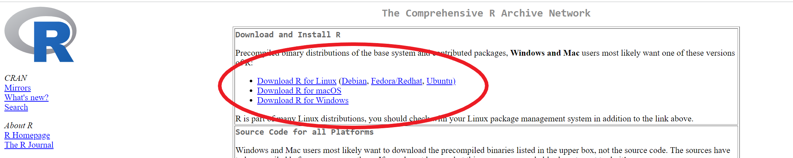
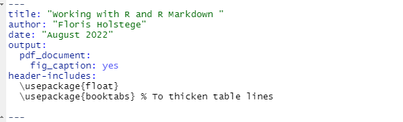

```{r, include=FALSE}


# Packes required for subsequent analysis. P_load ensures these will be installed and loaded. 
if (!require("pacman")) install.packages("pacman")
pacman::p_load(knitr,
               ggplot2,
               png)

```


\section{Introduction}

This tutorial is provides the building blocks to make everyone comfortable with the environment we will be using in this course.  
\begin{enumerate}
  \item Getting started with the R programming language
  \item R markdown (which was also used to create this document)
\end{enumerate}


\section{The R programming language}

All of the assignments in this course will make use of the R programming language. You might have already worked with R and have it installed. If not, go through the following steps:

\begin{enumerate}
  \item Go to \href{https://cran.r-project.org/}{this page} and select 'install R' for your operating system. The image below illustrates where you need to be.
  
```{r, echo=FALSE, fig.pos="H", fig.align="center",out.width="50%"}

```


  \item After that, go to \href{https://www.rstudio.com/products/rstudio/download/}{this page} and download the free version of Rstudio. Again, select the installation for your operating system. The image on the next page illustrates where you should be looking. 
  
\end{enumerate}
```{r, echo=FALSE, fig.pos="H", fig.align="center",out.width="50%"}
include_graphics('input/install_rstudio.png')
```


It is outside the scope of this document to learn you everything about the R programming language. Rather, I will point to several resources one can use if (1) you want to get some experience in R before the course starts, or (2) if you are stuck with your R code. 

\begin{itemize}
\item \textbf{Tutorials:}
\begin{itemize}
\item \textbf{Syntax and data structures}: Datacamp provides a comprehensive introductory course into R. Goes over all the basic data structures and syntax. Free tutorials can be found  \href{https://www.datacamp.com/courses/free-introduction-to-r}{here}. 
\item \textbf{Plot making}: for an introduction to making plots in R with ggplot2, see the following \href{https://r4ds.had.co.nz/data-visualisation.html}{ overview}.
\item \textbf{If you are stuck}, \href{https://stackoverflow.com/}{stack overflow} is your best friend
\end{itemize}

\end{itemize}


\section{R markdown}

R markdown can be used to combine (1) latex and (2) R code to create documents. 

\subsection*{1. Installation}

In order to use R markdown, you will need to install several things. 

\begin{enumerate}
\item Usually, R markdown will be part of the R studio version you have downloaded. Just in case it is not, you can install it with the following command: 
\end{enumerate}

```{r, eval=FALSE}
install.packages('rmarkdown') # install rmarkdown
```

\begin{enumerate}
  \setcounter{enumi}{1}
  \item If you would like to create PDF documents from R Markdown, you will need to have a LaTeX distribution installed. It is recommended to install the following  custom LaTeX distribution called TinyTex.
\end{enumerate}

```{r, eval=FALSE}
install.packages('tinytex')
tinytex::install_tinytex()  # install TinyTeX

```


\subsection{2. Set-up of the document}

Before we can start putting text in the document, we need to go over several things in order to set it up. First, the set-up of the document. When creating a document, you define several parameters in order to make sure you get the correct output. For example, these are the parameters for the markdown file that created this document:

```{r, echo=FALSE, fig.pos="H", fig.align="center",out.width="75%"}

```

The most important parameters are:

\begin{itemize}
\item \textbf{output}: specifies what type of document you want to create. In our case, this is "pdf\_document".
\item \textbf{title, author and date}: These are used to formatting the title page of the document.
\item \textbf{header-includes}: contains any Latex packages you want to add. 
\end{itemize}

Once you have set the parameters, you can create the pdf output by 'knitting' the document. In the image below, the 'knit' button is circled red at (1). At (2) the parameters are defined, and at (3) we load in our libraries. We recommend using `pacman::p_load`  since it automatically installs and loads any specified packages. The text and code is usually written below (3)


```{r, echo=FALSE, fig.pos="H", fig.align="center",out.width="100%"}
include_graphics('input/rmarkdown_setup_illustrated_v2.png')
```
  


\subsection{3. Writing text and code}

In R markdown, one can write text the same way one writes text in Latex. Below is an example that loads data. The `include = FALSE` argument ensures that this code snippet is run but neither the code nor its output show in the generated pdf. 

```{r, echo=FALSE, fig.pos="H", fig.align="center",out.width="30%"}
include_graphics('input/eval_false.png')
```

Below is an overview of some of the key parameters for code chunks in R markdown. 

\begin{table}[H]
    \centering
      \caption{What each parameter does to the code chunk}
    \begin{tabular}{lccc}
    \toprule
       \textbf{Parameter}  & Run Code & Show Code & Show Output \\
    \midrule
       eval = FALSE  & No & Yes & No\\
       echo = FALSE  & Yes & No & Yes\\
       include = FALSE  & Yes & No & No\\
    \bottomrule 
    \end{tabular}
    \label{tab:param_chunks}
\end{table}

You can also use the following options for some simple changes.

```{r echo=FALSE, fig.pos="H", fig.align="center",out.width="50%"}
  include_graphics('input/options.png')
```


\subsection{4. Making plots}

One of the nicest features of R markdown is that you can directly incorporate your plots into the pdf. For instance, if we want to generate a plot that is centered and takes up 50\% of the page width, we can use the following parameters in our code chunk:


```{r echo=FALSE, fig.pos="H", fig.align="center",out.width="70%"}
include_graphics('input/plot_options.png')
```

The following is an example of how to make a plot in Rmarkdown. We use a dataset with information on passengers on the titanic.

```{r }

# Reads in the csv as an R dataframe
df_titanic <- read.csv('../data/titanic.csv')


# create ggplot object of histogram of the age of passengers
age_titanic_passengers_plot <- ggplot(data = df_titanic, # datast to work with
                                      aes(x = Age))+ # variable for x-axis is Age
                                geom_histogram(bins=20)+ # create  a histogram with 20 bins
                                labs(y = 'Frequency')+ # name for the Y-lab
                                theme_bw()+ # theme of the plot
                                theme(text = element_text(size=20)) # increase the font size

age_titanic_passengers_plot


```
